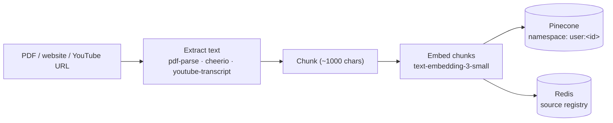
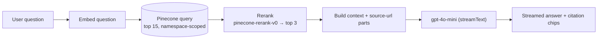
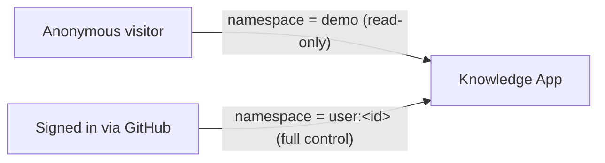

# Knowledge App

A retrieval-augmented chat app: add PDFs, websites, or YouTube videos as knowledge sources, then ask questions and get answers grounded in that content — with reranked retrieval, inline citations, per-user knowledge bases, and an automated eval harness.

**[Live demo →](#)** _(link added after deployment)_

## Why I built this

Most "chat with your PDF" projects stop at wiring an embedding model to a vector database. This one is meant to demonstrate the parts of RAG that actually matter in production: measuring whether retrieval is any good (not just eyeballing one answer), improving on naive top-k cosine similarity with a reranking pass, showing users what the answer is actually grounded in, and treating a public demo link as something that needs abuse protection and per-user data isolation — not a single shared sandbox.

## Architecture

### Ingestion (signed-in users only)



### Chat: retrieval, reranking, citations



### Auth & multi-tenancy



Anonymous visitors get a shared, read-only **demo** knowledge base (seeded via `npm run seed`) so there's something to try immediately — no signup wall on a portfolio link. Signing in with GitHub unlocks a private knowledge base, scoped by a Pinecone **namespace** per user (`pineconeIndex.namespace(...)`), so one user's sources never leak into another's retrieval.

## Design decisions & trade-offs

- **Reranking via Pinecone's hosted `pinecone-rerank-v0` model**, not a separate vendor. Vector similarity alone (top-k cosine) is a fast but crude first pass; reranking re-scores a wider candidate set (15) against the actual query before picking the final top 3. Using Pinecone's own inference API avoided adding a second AI vendor/account for this.
- **Citations via the AI SDK's native `source-url` message parts**, streamed alongside the answer (`createUIMessageStream` + `writer.write`/`writer.merge`) rather than asking the model to cite sources in plain text — the citation list is exactly the reranked chunks actually used, not something the model can hallucinate or omit.
- **Namespaces over a full multi-tenant database.** Every user's (and the demo's) vectors live in the same Pinecone index, isolated by namespace, and the small per-source registry lives in Upstash Redis keyed by namespace. This avoids standing up Postgres for what amounts to a handful of small lookups, while still giving hard isolation between tenants.
- **JWT sessions, no user database.** Auth.js with the GitHub provider in JWT mode uses the GitHub account id as the stable tenant id — enough for namespacing without a database of accounts to manage.
- **Rate limiting reuses the existing Redis instance** (`@upstash/ratelimit`) rather than adding another service — sliding-window limits, tighter for anonymous demo traffic than for signed-in users, since a public link with real API keys behind it needs abuse protection.

## Eval results

Run via `npm run eval` against the seeded demo knowledge base (6 questions across the 3 seeded articles, each checked for both retrieval accuracy and answer correctness via an LLM-as-judge pass):

| Metric | Result |
| --- | --- |
| Retrieval hit-rate (expected source in reranked top 3) | 100% (6/6) |
| Answer correctness (LLM-as-judge vs. reference answer) | 100% (6/6) |
| Avg retrieval latency (embed + query + rerank) | ~2.8s |
| Avg generation latency | ~2.7s |

Full per-question output is written to `eval-results.json` on each run. The dataset lives in `scripts/eval-dataset.json` — add more question/expected-source/expected-answer triples to grow coverage.

## Stack

Next.js (App Router) · React · TypeScript · Tailwind CSS · shadcn/ui · Vercel AI SDK · OpenAI · Pinecone (vector search + reranking) · Upstash Redis (registry + rate limiting) · Auth.js (GitHub OAuth)

## Getting started

1. Install dependencies:

   ```bash
   npm install
   ```

2. Copy `.env.example` to `.env.local` and fill in the values:

   ```bash
   cp .env.example .env.local
   ```

   | Variable | Where to get it |
   | --- | --- |
   | `OPENAI_API_KEY` | [platform.openai.com](https://platform.openai.com/api-keys) |
   | `PINECONE_API_KEY` | [app.pinecone.io](https://app.pinecone.io) |
   | `UPSTASH_REDIS_REST_URL` / `UPSTASH_REDIS_REST_TOKEN` | [console.upstash.com](https://console.upstash.com) — Regional Redis database, REST API section |
   | `AUTH_SECRET` | Any random string, e.g. `openssl rand -base64 33` |
   | `AUTH_GITHUB_ID` / `AUTH_GITHUB_SECRET` | [github.com/settings/developers](https://github.com/settings/developers) → New OAuth App. Callback URL: `http://localhost:3000/api/auth/callback/github` |

3. In Pinecone, create an index named `knowledge-app` with:
   - Dimension: `1536` (matches `text-embedding-3-small`)
   - Metric: `cosine`

4. Seed the shared demo knowledge base:

   ```bash
   npm run seed
   ```

5. Run the dev server:

   ```bash
   npm run dev
   ```

   Open [http://localhost:3000](http://localhost:3000).

6. (Optional) Run the eval harness:

   ```bash
   npm run eval
   ```

## Known limitations

- **Bot-protected websites fail to ingest.** Sites behind Cloudflare-style bot protection (e.g. Fandom wikis) return a 403 even with a browser-like `User-Agent`, since the app does a plain server-side `fetch`, not a headless browser. Shows a clear error rather than a raw status code; a real fix would mean rendering with a headless browser, which is out of scope here.
- **Right-to-left languages (Arabic, Persian, Hebrew) extract garbled from PDFs.** PDF text comes from `pdf-parse`/`pdfjs-dist`'s text-layer extraction, which doesn't reliably preserve RTL glyph ordering — the PDF ingests without error, but the extracted text (and therefore retrieval) is unusable for that source. Correctly handling this needs a bidi-aware or OCR-based extractor, which is a meaningfully bigger effort than fits here. Left-to-right languages are unaffected.

## Deploying

Deploy to [Vercel](https://vercel.com/new) and set all 7 environment variables in the project settings. GitHub OAuth Apps are tied to one callback URL, so a second OAuth App (or an updated callback) is needed once the production domain is known — pointing at `https://<your-domain>/api/auth/callback/github`.
